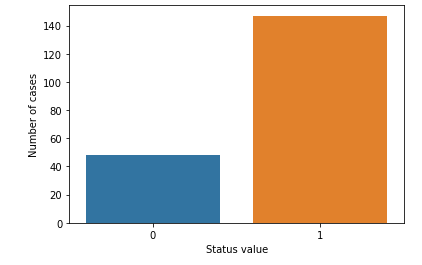
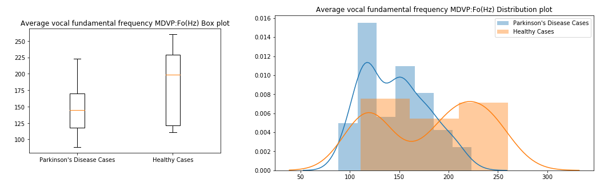
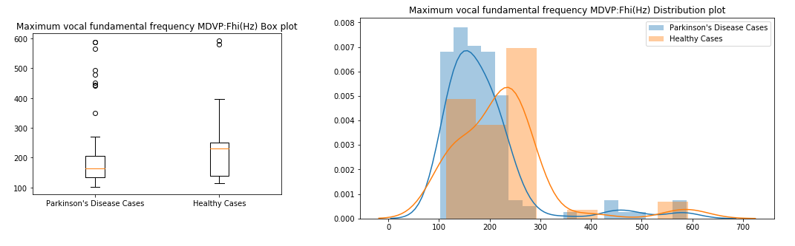
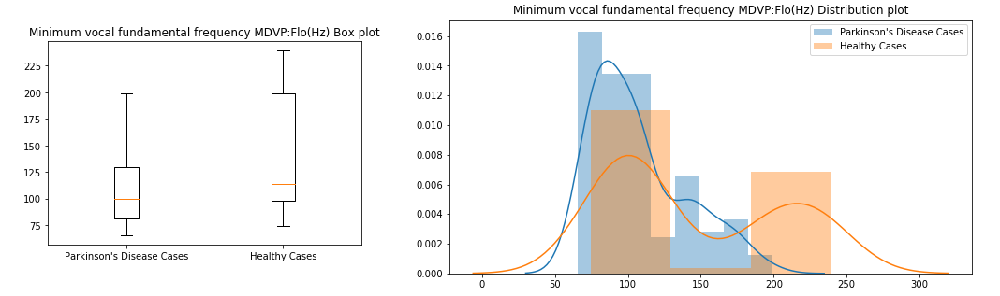
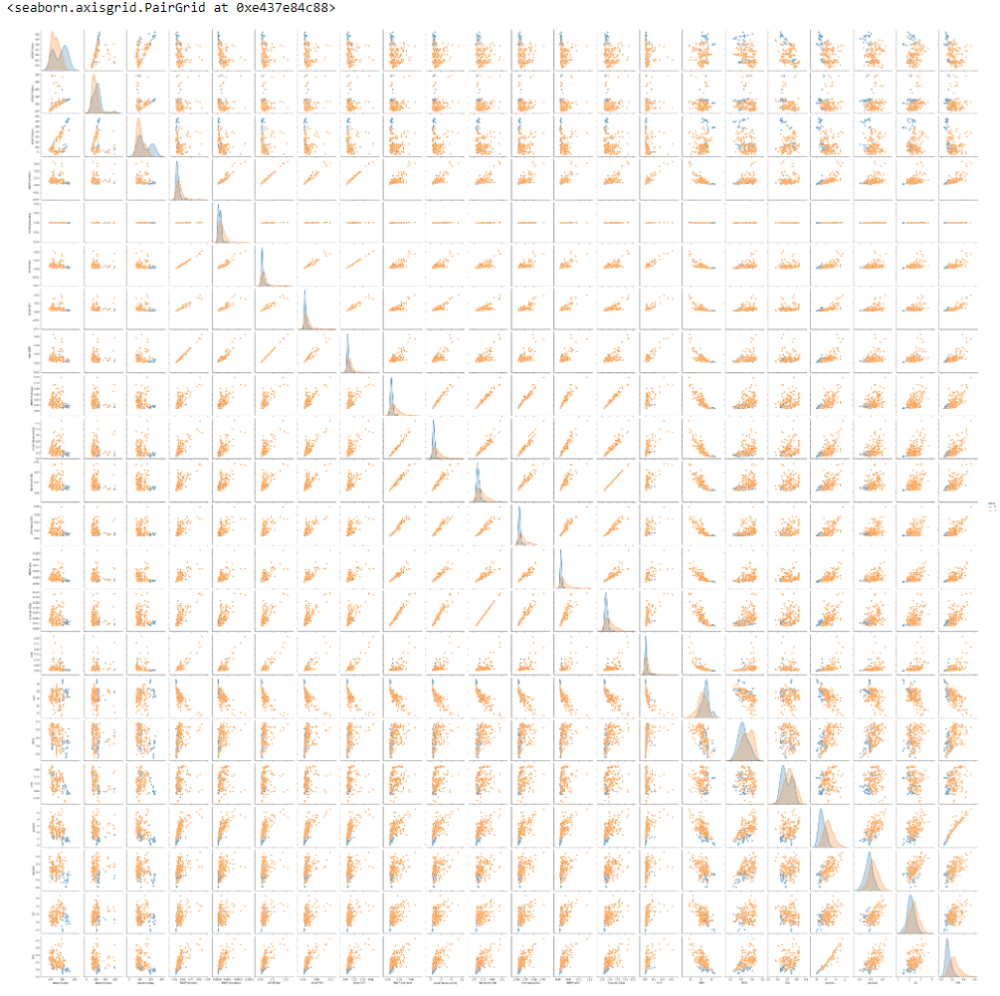

# Parkinson's Disease Exploratory Data Analysis and Prediction

In this Repository we will perform Exploratory Data analysis and then predict the Parkinson's Disease. I have collected the data from [UCI ML Parkinson’s dataset](https://archive.ics.uci.edu/ml/machine-learning-databases/parkinsons/).

Neurodegenerative diseases are a heterogeneous group of disorders that are characterized by the progressive degeneration of the structure and function of the nervous system. They are incurable and debilitating conditions that cause problems with mental functioning also called dementias. Alzheimer’s disease and Parkinson’s disease are the most common neurodegenerative diseases.

The data set has 195 samples. Each row of the data set consists of voice recording of individuals with name and 23 attributes of biomedical voice measurements.
The main aim of the data is to discriminate healthy people from those with Parkinson's Disease, according to "status" column which is set to `0` for healthy and `1` for individual affected with Parkinson's Disease.

**Attribute Information:**

| Attributes  | Description   |
|-------------|-----------------|
| name         | ASCII subject name and recording number |
| MDVP:Fo(Hz)  | Average vocal fundamental frequency     |
| MDVP:Fhi(Hz) | Maximum vocal fundamental frequency     |
| MDVP:Flo(Hz) | Minimum vocal fundamental frequency     |
| MDVP:Jitter(%), MDVP:Jitter(Abs), MDVP:RAP, MDVP:PPQ, Jitter:DDP | Several measures of variation in fundamental frequency |
| MDVP:Shimmer, MDVP:Shimmer(dB), Shimmer:APQ3, Shimmer:APQ5, MDVP:APQ, Shimmer:DDA | Several measures of variation in amplitude |
| NHR, HNR     | Two measures of ratio of noise to tonal components in the voice    |
| status       | Health status of the subject (one) - Parkinson's, (zero) - healthy |
| RPDE, D2     | Two nonlinear dynamical complexity measures                        |
| DFA          | Signal fractal scaling exponent                                    |
| spread1, spread2, PPE | Three nonlinear measures of fundamental frequency variation |

## Exploratory Data Analysis

### Univariate Analysis
The dataset consists of:  
Number of Parkinson's Disease patients: **147** (75.38%)  
Number of Healthy patients: **48** (24.62%)  

I used box plots and Distribution plots on every input for the EDA. Some of the examples:  
**Average vocal fundamental frequency MDVP:Fo(Hz)**

**Maximum vocal fundamental frequency MDVP:Fhi(Hz)**

**Minimum vocal fundamental frequency MDVP:Flo(Hz)**

Similarly I performed EDA on all the input attributes like Jitter, Shimmer, Non-linear measures etc.,

### Bivariate Analysis

Also I used `sns.pairplot` to find out the pairwise relationship of the attributes.

## Parkinson's Disease Prediction

I used `pipeline` to combine all the pre-processing and modelling into a single object. Then used `GridSearchCV` to fine tune hyperparameters to find out the best model accuracy of `LogisticRegression` model on Parkinson's Disease identification.

The best accuracy achieved is **89.83%** with the parameter `C = 7.196856730011521
`

**Note:** This is a very basic analysis. We can also use other methods to predict and can achieve highest accuracy.

